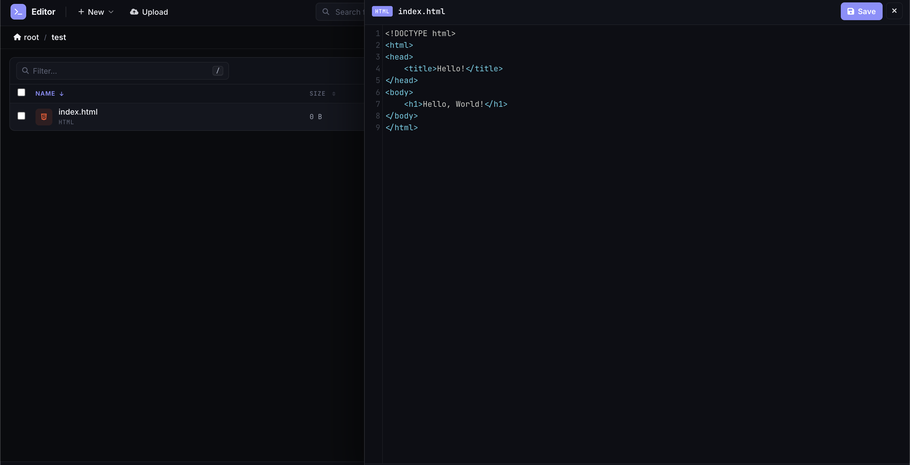
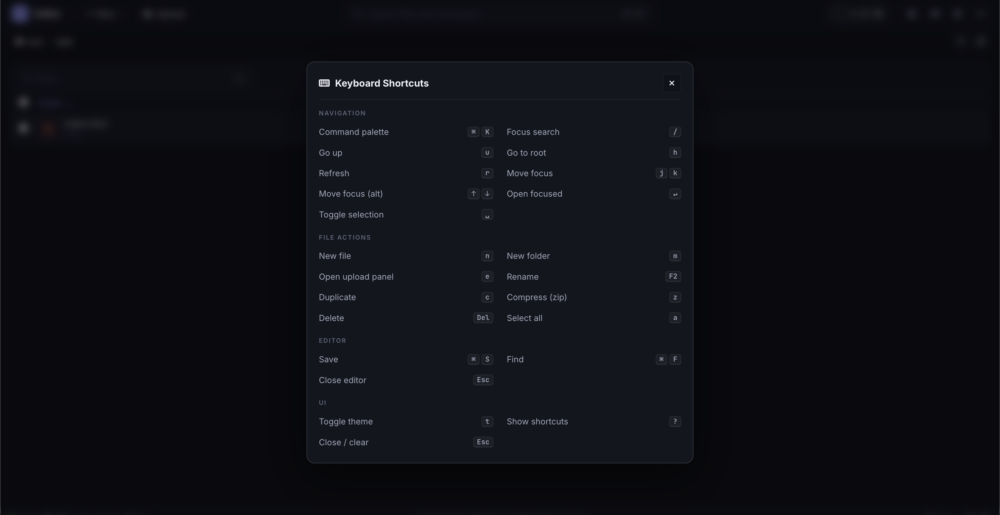
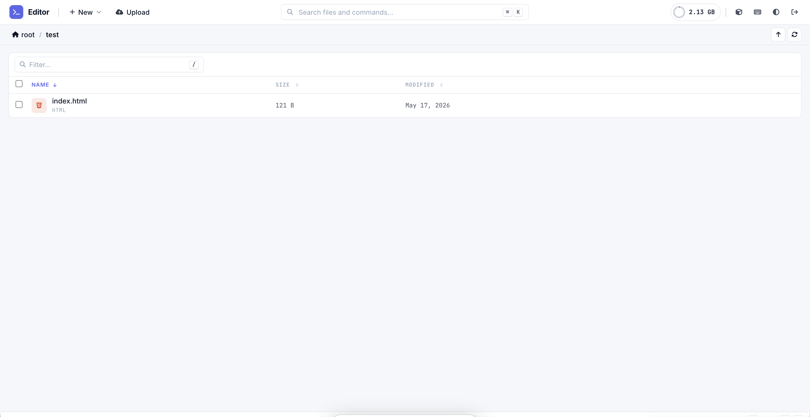
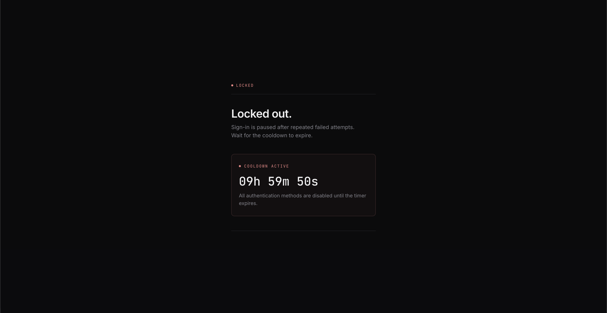
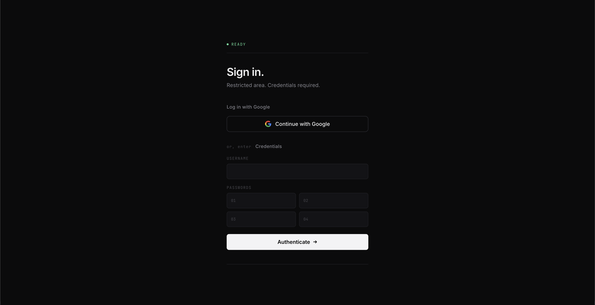
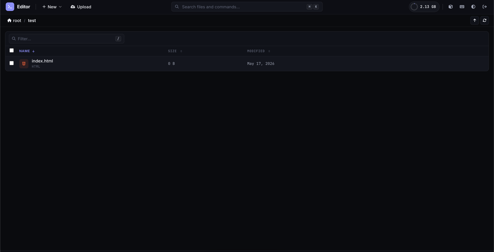
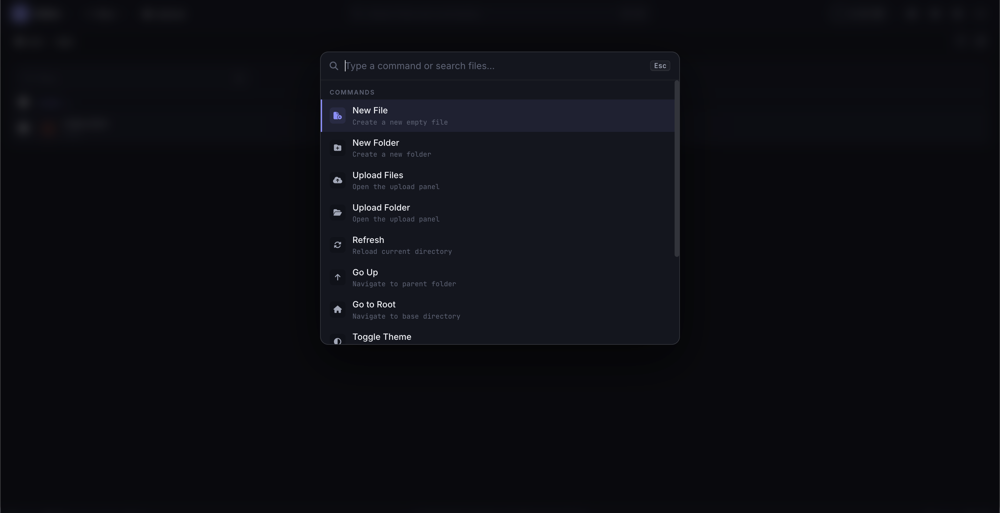

# file-manager
in-website, sleek and beautiful PHP file manager. Similar to TinyFileManager.

## App Screenshots
Here is a tour of the tool interface:

### Editor

---

### Keyboard

---

### Light Mode

---

### Locked Out After 5 Failed Attempts

---

### Login Page

---

### Panel

---

### Spotlight

